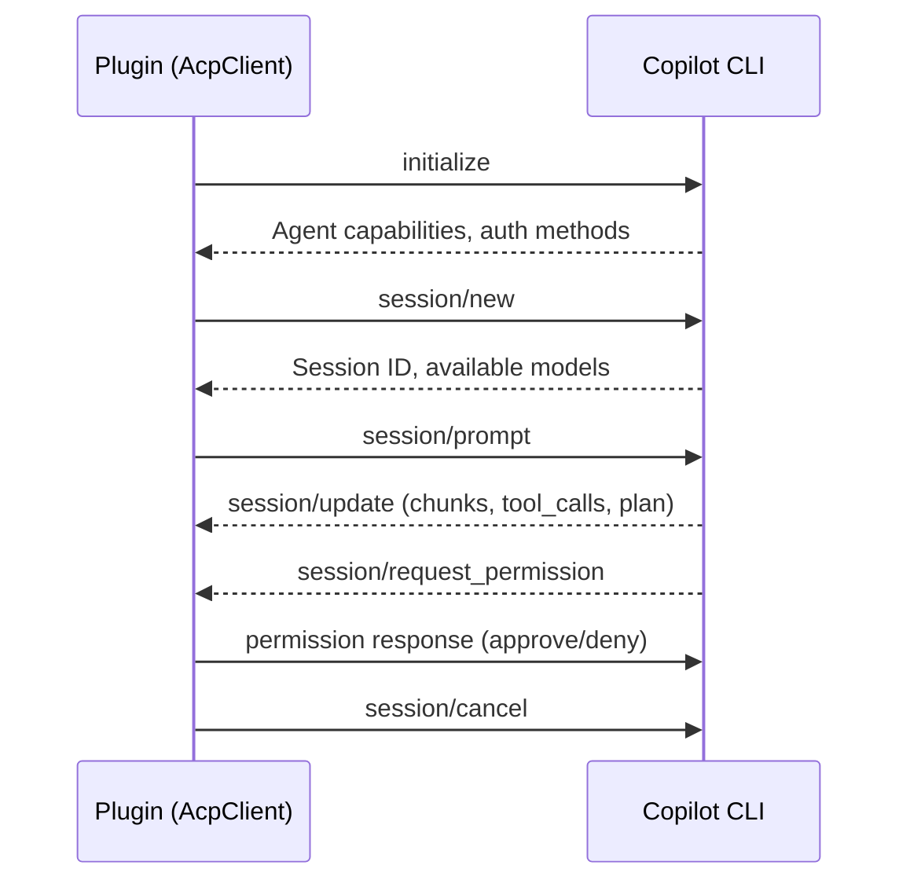
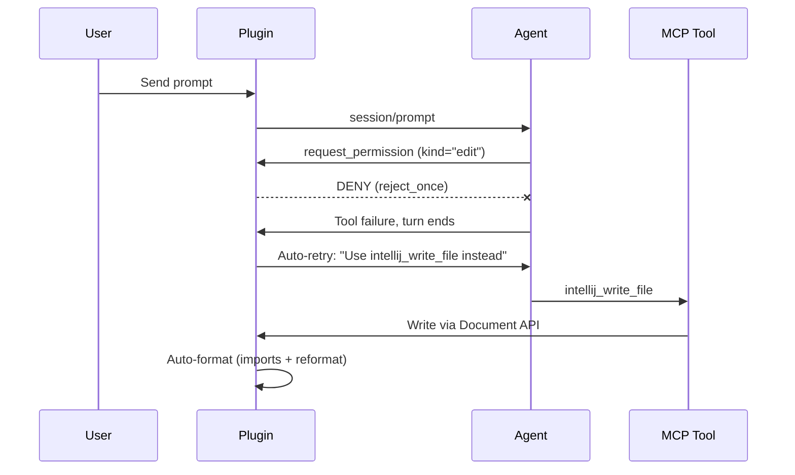
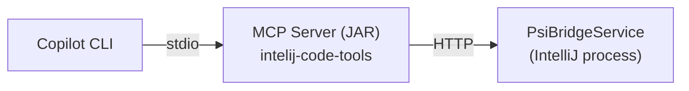

# Development Guide

## Build & Deploy

### Prerequisites

- JDK 21 (Gradle JVM pinned via `gradle.properties` → `org.gradle.java.home`)
- GitHub Copilot CLI installed and authenticated
    - **Windows**: `winget install GitHub.Copilot`
    - **Linux**: `sudo npm install -g @anthropic-ai/copilot-cli` or download from GitHub releases

### Build Plugin

```bash
# Linux
./gradlew :plugin-core:clean :plugin-core:buildPlugin

# Windows (PowerShell)
.\gradlew.bat :plugin-core:clean :plugin-core:buildPlugin
```

Output: `plugin-core/build/distributions/plugin-core-0.2.0-<hash>.zip`

> **Note**: If `clean` fails due to locked sandbox files (Windows), omit `:plugin-core:clean`.

### Deploy to IntelliJ

The plugin ZIP must be extracted into IntelliJ's plugin directory.

> **Note:** For Toolbox-managed IntelliJ on Linux, plugins are direct subfolders under
> `~/.local/share/JetBrains/IntelliJIdea<version>/` — there is **no** `plugins/` parent directory.

**Linux:**

```bash
# Find your IntelliJ plugin directory (adjust version as needed)
# Toolbox-managed: plugins are direct subfolders (no /plugins parent)
PLUGIN_DIR=~/.local/share/JetBrains/IntelliJIdea2025.3

# Stop IntelliJ if running, then install
rm -rf "$PLUGIN_DIR/plugin-core"
unzip -q plugin-core/build/distributions/plugin-core-*.zip -d "$PLUGIN_DIR"

# Launch IntelliJ
idea &  # or full path to idea.sh
```

**Windows (PowerShell):**

```powershell
$ij = Get-Process -Name "idea64" -ErrorAction SilentlyContinue
if ($ij) { Stop-Process -Id $ij.Id -Force; Start-Sleep -Seconds 5 }

Remove-Item "$env:APPDATA\JetBrains\IntelliJIdea2025.3\plugins\plugin-core" -Recurse -Force -ErrorAction SilentlyContinue
Expand-Archive "plugin-core\build\distributions\plugin-core-*.zip" `
    "$env:APPDATA\JetBrains\IntelliJIdea2025.3\plugins" -Force

Start-Process "$env:LOCALAPPDATA\JetBrains\IntelliJIdea2025.3\bin\idea64.exe"
```

### Deploy to Main IDE After Code Changes

The sandbox IDE (`runIde`) picks up changes automatically, but the **main IDE does not**.
After every code change, run these 3 commands to rebuild and deploy:

```bash
cd /path/to/ide-agent-for-copilot

# 1. Build the plugin zip (-x buildSearchableOptions avoids launching a conflicting IDE instance)
./gradlew :plugin-core:buildPlugin -x buildSearchableOptions --quiet

# 2. Remove the old installed plugin (stale JARs cause issues otherwise)
rm -rf ~/.local/share/JetBrains/IntelliJIdea2025.3/plugin-core

# 3. Extract the new one (zip filename includes commit hash, so always use latest)
unzip -q "$(ls -t plugin-core/build/distributions/*.zip | head -1)" -d ~/.local/share/JetBrains/IntelliJIdea2025.3/
```

Then **restart the main IDE**.

> **Key points:**
> - The plugin install path is `~/.local/share/JetBrains/IntelliJIdea2025.3/plugin-core/` — no `plugins/` subfolder (
    Toolbox-managed layout)
> - You **must** `rm -rf` the old folder first, then unzip — otherwise stale JARs remain
> - `-x buildSearchableOptions` is required because that task tries to launch an IDE instance which conflicts with the
    running one
> - The zip filename includes a commit hash (e.g. `plugin-core-0.2.0-2bb9797.zip`), so always use `ls -t ... | head -1`
    to get the latest

### Sandbox IDE (Development)

Run the plugin in a sandboxed IntelliJ instance (separate config/data, doesn't touch your main IDE):

```bash
# Linux
./gradlew :plugin-core:runIde

# Windows (PowerShell)
.\gradlew.bat :plugin-core:runIde
```

- First launch takes ~90s (Gradle configuration + dependency resolution)
- Opens a fresh IntelliJ with the plugin pre-installed
- Sandbox data stored in `plugin-core/build/idea-sandbox/`
- Open a **different project** than the one open in your main IDE to avoid conflicts

**Auto-reload (Linux only):** `autoReload = true` is configured in `build.gradle.kts`. On Linux, after code changes run
`./gradlew :plugin-core:prepareSandbox` and the plugin reloads without restarting the sandbox IDE. On Windows, file
locks prevent this — close the sandbox IDE first, then re-run `runIde`.

**Iterating on changes:**

1. Close the sandbox IDE (Windows) or leave it open (Linux)
2. `./gradlew :plugin-core:prepareSandbox` (rebuilds plugin into sandbox)
3. On Windows: `./gradlew :plugin-core:runIde` (relaunches sandbox)
4. On Linux: plugin auto-reloads in the running sandbox IDE

### Run Tests

```bash
./gradlew test                              # All tests
./gradlew :plugin-core:test                 # Plugin unit tests only
./gradlew :mcp-server:test                  # MCP server tests only
./gradlew :plugin-core:test -Dinclude.integration=true  # Include integration tests
```

## Architecture

### ACP Protocol Flow

The plugin communicates with GitHub Copilot CLI via the **Agent Client Protocol (ACP)** — JSON-RPC 2.0 over
stdin/stdout:



### Permission Deny + Retry Flow

Built-in Copilot file operations are **denied** so all writes go through IntelliJ's Document API:



**Denied permission kinds**: `edit`, `create`, `read`, `execute`, `runInTerminal`  
**Auto-approved**: `other` (MCP tools)  
**Intercepted via notifications**: `view`, `grep`, `glob` (read-only built-in tools that bypass permission)

### MCP Tool Bridge



- **MCP Server** (`mcp-server/`): Standalone JAR, stdio protocol, routes tool calls to PSI bridge
- **PSI Bridge** (`PsiBridgeService`): HTTP server inside IntelliJ process, accesses PSI/VFS/Document APIs
- **Bridge file**: `~/.copilot/psi-bridge.json` contains port for HTTP connection

### Auto-Format After Write

Every file write through `intellij_write_file` triggers:

1. `PsiDocumentManager.commitAllDocuments()`
2. `OptimizeImportsProcessor`
3. `ReformatCodeProcessor`

This runs inside a single undoable command group on the EDT.

### JCEF Cursor Bridge

JCEF does **not** propagate CSS `cursor` values to the Swing host component. Setting
`cursor: grab` in CSS changes the cursor inside the Chromium renderer, but the Swing
`JComponent` that wraps the browser ignores it — the user sees the default arrow.

All cursor changes must go through a three-layer bridge:

```
CSS (visual only) → JS mouseover / event handler → _bridge.setCursor(name) → Kotlin → java.awt.Cursor
```

**Layer 1 — CSS** (`chat.css`): Declare `cursor:` as usual for web styling. This is still
needed for the in-browser rendering but has **no effect** on the actual Swing cursor.

**Layer 2 — JavaScript** (`index.ts` + component files):
- A global `mouseover` listener in `index.ts` maps element selectors to cursor names
  (e.g. `.chip-strip` → `'grab'`, `.tool-popup-resize` → `'nwse-resize'`).
- For **dynamic** cursor changes (drag-in-progress, resize-in-progress), the component must
  call `globalThis._bridge?.setCursor()` directly in its `mousedown`/`mouseup` handlers,
  because `mouseover` doesn't fire when a CSS class is toggled on the current element.

**Layer 3 — Kotlin** (`ChatConsolePanel.kt`): The `cursorQuery` handler maps string names
to `java.awt.Cursor` constants:

| Bridge value      | Java cursor                  |
|-------------------|------------------------------|
| `"pointer"`       | `HAND_CURSOR`                |
| `"text"`          | `TEXT_CURSOR`                |
| `"grab"`, `"grabbing"` | `MOVE_CURSOR`          |
| `"nwse-resize"`   | `SE_RESIZE_CURSOR`           |
| anything else     | `DEFAULT_CURSOR`             |

**When adding a new interactive cursor:**

1. Add the CSS `cursor:` property (for in-browser rendering)
2. Add the selector to the `mouseover` handler in `index.ts`, **or** call
   `globalThis._bridge?.setCursor()` directly from the component's event handlers
3. Add the string → `java.awt.Cursor` mapping in `ChatConsolePanel.kt`

## Key Files

| File                                                    | Purpose                                     |
|---------------------------------------------------------|---------------------------------------------|
| `plugin-core/.../bridge/AcpClient.java`              | ACP client, permission handler, retry logic |
| `plugin-core/.../psi/PsiBridgeService.java`             | 83 MCP tools via IntelliJ APIs              |
| `plugin-core/.../services/CopilotService.java`          | Service entry point, starts ACP client      |
| `plugin-core/.../ui/AgenticCopilotToolWindowContent.kt` | Main UI (Kotlin Swing)                      |
| `mcp-server/.../mcp/McpServer.java`                     | MCP stdio server, tool registrations        |

## Debugging

### Enable Debug Logging

Add to `Help > Diagnostic Tools > Debug Log Settings`:

```
#com.github.catatafishen.ideagentforcopilot
```

### Log Locations

- **Linux IDE**: `~/.local/share/JetBrains/IntelliJIdea2025.3/log/idea.log`
- **Windows IDE**: `%LOCALAPPDATA%\JetBrains\IntelliJIdea2025.3\log\idea.log`
- **Sandbox IDE**: `plugin-core/build/idea-sandbox/IU-2025.3.1.1/log/idea.log`
- **PSI bridge port**: `~/.copilot/psi-bridge.json`

### Common Issues

| Issue                             | Cause                         | Fix                                  |
|-----------------------------------|-------------------------------|--------------------------------------|
| "Error loading models"            | Copilot CLI not authenticated | Run `copilot auth`                   |
| "RPC call failed: session.create" | ACP process died              | Check `idea.log` for stderr          |
| Agent uses built-in edit tool     | Deny+retry not working        | Check permission handler logs        |
| "file changed externally" dialog  | Write bypassed Document API   | Verify `intellij_write_file` is used |

### Platform API False Positives (`PlatformApiCompat`)

The IDE daemon shows false-positive resolution errors on certain IntelliJ Platform API calls.
This happens because the dev IDE resolves symbols against its **own** bundled platform JARs,
which differ from the target SDK configured in Gradle (`platformVersion` in `build.gradle.kts`).
The Gradle build compiles cleanly — only the IDE analyzer is affected.

**Symptoms:** Red error highlights like `Cannot resolve method 'getService'`, `Cannot resolve
method 'connect()'`, `Unknown class`, or `Incompatible types` on standard platform API calls.

**Solution:** All affected API calls are wrapped in
`PlatformApiCompat.java` (`plugin-core/.../psi/PlatformApiCompat.java`). This concentrates
all false positives in a single file. Each wrapper method has Javadoc explaining:
- What the original API call is
- Why the IDE shows a false positive
- Why it compiles and works correctly at runtime

**When you encounter a new false positive:**

1. Add a new static method to `PlatformApiCompat` with a descriptive name
2. Add Javadoc explaining the false positive (follow existing examples)
3. Replace the call site with the wrapper
4. Verify with `./gradlew :plugin-core:compileJava :plugin-core:compileKotlin --quiet`

**Known false-positive patterns:**

| Pattern | Example |
|---------|---------|
| `@NotNull` annotation mismatch | `PluginManagerCore.isPluginInstalled(PluginId)` |
| Extension point generics | `ConfigurationType.CONFIGURATION_TYPE_EP.getExtensionList()` |
| `Project.getService(Class<T>)` wildcard bounds | `project.getService(someClass)` |
| MessageBus connect/subscribe/disconnect | `project.getMessageBus().connect()` |
| JCEF adapter method signatures | `CefLoadHandlerAdapter`, `CefDisplayHandlerAdapter` |
| Kotlin platform types vs Java generics | `LafManagerListener.TOPIC` |
| Git4Idea bundled plugin APIs | `HashImpl`, `GitRepositoryManager`, `GitLineHandler` |
| JPS model types | `JavaSourceRootType`, `JavaSourceRootProperties` |
| `ThrowableRunnable` functional interface | `WriteAction.runAndWait()` |

## Dynamic Plugin Loading

The plugin declares `require-restart="false"` in `plugin.xml` and uses only dynamic-compatible
extension points (including `ProjectActivity` instead of the legacy `StartupActivity`).

### Platform limitation: "Install from Disk" always requires restart for updates

IntelliJ's `PluginInstaller.installFromDisk` (2025.3) contains this logic:

```java
Path oldFile = installedPlugin != null && !installedPlugin.isBundled()
        ? installedPlugin.getPluginPath() : null;
boolean isRestartRequired = oldFile != null
        || !DynamicPlugins.allowLoadUnloadWithoutRestart(pluginDescriptor)
        || operation.isRestartRequired();
```

The `oldFile != null` check **short-circuits** — when the plugin is already installed (i.e. an
update), `oldFile` is always non-null, so the platform never even calls
`allowLoadUnloadWithoutRestart`. Restart is unconditionally required for all disk-based updates.

This means:

- **Fresh install from disk** → can load dynamically (no restart) ✅
- **Update existing plugin from disk** → always requires restart ❌
- **Marketplace updates** → use a different code path that supports dynamic updates ✅
- **Sandbox `autoReload`** → uses `prepareSandbox` + `DynamicPlugins` API directly ✅

### What we did to support dynamic loading

1. **`require-restart="false"`** in `plugin.xml`
2. **Migrated `PsiBridgeStartup`** from Java `StartupActivity.DumbAware` (legacy, non-dynamic) to
   Kotlin `ProjectActivity` (modern, dynamic-compatible)
3. **All extension points are dynamic-compatible**: `toolWindow`, `applicationService`,
   `projectService`, `postStartupActivity` (with `ProjectActivity`), `notificationGroup`, `iconMapper`
4. **No legacy components**: no `<application-components>` or `<project-components>`
5. **No `<listeners>` section** that could block unload

### Verifying dynamic compatibility at runtime

`PsiBridgeStartup` previously included a diagnostic that called
`DynamicPlugins.allowLoadUnloadWithoutRestart()` via reflection. At runtime this returns `true`,
confirming the plugin is dynamic-compatible from the platform's perspective.

### Workarounds for development

- **Sandbox IDE**: Use `./gradlew :plugin-core:prepareSandbox` — auto-reload works without restart
- **Main IDE (CLI deploy)**: Use the `rm -rf` + `unzip` approach from
  the [Deploy](#deploy-to-main-ide-after-code-changes) section, then restart
- **Main IDE (UI install)**: Accept the restart — it's a platform limitation for disk-based updates

## Test Coverage

- **AcpProtocolRegressionTest**: 16 tests — protocol format, permission handling, deny logic
- **AcpEndToEndTest**: 33 tests — end-to-end protocol flows, streaming, tool calls
- **CopilotAcpClientTest**: 15 tests — DTOs, lifecycle, real Copilot integration
- **CopilotFreeModelIntegrationTest**: 3 tests — free model integration
- **WrapLayoutTest**: 6 tests — UI layout
- **McpServerTest**: 24 tests — all MCP tools, security (path traversal), protocol

## Contributing

### Branch Strategy

- **`master`** is protected — no direct pushes
- Create feature branches and merge through pull requests
- PRs run CI automatically (build + test + plugin verification)
- Merging to `master` triggers automatic versioning and release

### Conventional Commits

All commit messages **must** follow the [Conventional Commits](https://www.conventionalcommits.org/) specification.
The release workflow uses these to automatically determine the next semantic version.

**Format:** `<type>(<optional scope>): <description>`

| Type       | When to use                                    | Version bump |
|------------|------------------------------------------------|--------------|
| `feat`     | New feature or capability                      | **minor**    |
| `fix`      | Bug fix                                        | **patch**    |
| `docs`     | Documentation only                             | **patch**    |
| `chore`    | Build, CI, tooling, dependencies               | **patch**    |
| `refactor` | Code change that neither fixes a bug nor adds a feature | **patch** |
| `test`     | Adding or updating tests                       | **patch**    |
| `perf`     | Performance improvement                        | **patch**    |
| `style`    | Formatting, whitespace (no logic change)       | **patch**    |

**Breaking changes** → **major** bump:
- Add `!` after the type: `feat!: remove legacy API`
- Or include `BREAKING CHANGE:` in the commit body

**Examples:**
```
feat: add run_inspections tool with scope filtering
fix: resolve timeout when permission dialog is pending
docs: update changelog for 0.3.0 release
chore: bump Kotlin to 2.3.10
feat!: drop support for IntelliJ 2025.1
```

### CI/CD Pipeline

| Trigger              | Workflow  | What it does                                              |
|----------------------|-----------|-----------------------------------------------------------|
| Pull request opened  | `ci.yml`  | Build, test (MCP + plugin), verify plugin compatibility   |
| PR merged to master  | `release.yml` | Calculate next semver, tag, build release ZIP, publish GitHub Release |
