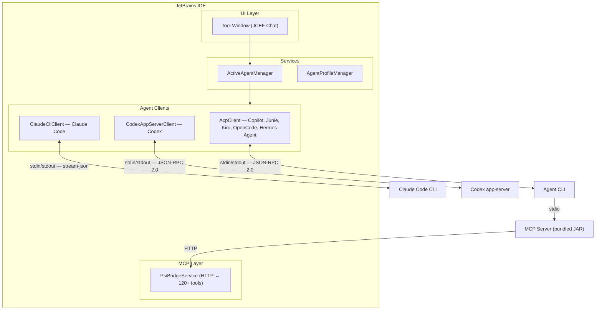

# AgentBridge

[](https://github.com/catatafishen/agentbridge/actions/workflows/ci.yml)
[](https://github.com/catatafishen/agentbridge/releases/latest)
[](https://plugins.jetbrains.com/plugin/30415-agentbridge)
[](LICENSE)
[](https://github.com/catatafishen/agentbridge/actions/workflows/codeql.yml)
[](https://codecov.io/gh/catatafishen/agentbridge)
[](https://scorecard.dev/viewer/?uri=github.com/catatafishen/agentbridge)
[](https://www.bestpractices.dev/projects/12428)

A JetBrains IDE plugin that bridges AI coding agents to IntelliJ platform APIs through
**120+ native MCP tools**. Agents work through inspections, refactorings, the test runner,
the build system, and Git — the same tools you use — instead of operating through a terminal
or generating diffs in isolation.

**Key highlights:**

- **7 agents** — Copilot, Claude Code, Codex, Kiro, Junie, OpenCode, Hermes Agent. Switch with one click.
- **120+ MCP tools** — code navigation, refactoring, testing, debugging, git, project management,
  and more — all through native IntelliJ APIs.
- **Cross-client session resume** — switch agents without losing conversation history.
- **PWA web access** — use the chat from any device on your local network via HTTPS.
- **Human in the loop** — every action is visible in the IDE. Undo, review, or redirect at any point.

## Why this approach?

AgentBridge is built around a simple idea: if a full JetBrains IDE helps humans work in a
fail-fast way, agents should be able to use that same IDE feedback loop too. Instead of asking
an LLM to approximate refactorings, code intelligence, inspections, Git state, and project
context from text alone, AgentBridge lets the agent call deterministic IDE tools directly.

See [The Case for IDE-Native Coding Agents](docs/IDE-NATIVE-CODING-AGENTS.md) for the longer
reasoning behind this IDE-native approach and why I think it is worth exploring alongside
lighter agent wrappers and harnesses.

## Project status, collaborators, and reviews

AgentBridge is starting to feel feature-ready. Most current work is tuning behavior, polishing
workflows, fixing rough edges, and following what agent CLIs expose through ACP so new capabilities
can be integrated as they become available.

I would be happy to have collaborators, especially for code review. I think a healthy practice for
agent-authored changes is to have at least two pairs of human eyes on important changes; right now I
mostly review the changes I asked Copilot to make. Just ping me if you would like to help.
I am also glad there are now actionable issues reported on GitHub. That feedback helps me prioritize
work and confirms that the effort I spend on this project is worthwhile.

If you use the plugin and find it useful, an honest rating or review on the
[JetBrains Marketplace](https://plugins.jetbrains.com/plugin/30415-agentbridge) would help other
users decide whether to try it. The plugin is approaching 2,000 downloads, and Marketplace update
stats suggest hundreds of active installs, but I understand why someone might hesitate to install
a plugin with no reviews.

## Supported Agents

| Agent                          | Protocol                   | Authentication                |
|--------------------------------|----------------------------|-------------------------------|
| **GitHub Copilot**             | ACP (stdin/stdout)         | OAuth sign-in                 |
| **Claude Code** (`claude` CLI) | Stream JSON (stdin/stdout) | Anthropic auth                |
| **Codex** (`codex app-server`) | ACP (stdin/stdout)         | Device-auth sign-in           |
| **Kiro**                       | ACP (stdin/stdout)         | Amazon auth                   |
| **Junie**                      | ACP (stdin/stdout)         | JetBrains auth                |
| **OpenCode**                   | ACP (stdin/stdout)         | Configurable (multi-provider) |

Switch between agents with one click. Each agent has its own connection settings,
tool permissions, and custom instructions.

## What Agents Can Do

Every action goes through IntelliJ platform APIs — nothing happens behind your back.

**Code intelligence** — Search symbols, find references, go to declaration, type hierarchy,
call hierarchy, class outlines, documentation lookup. Agents navigate code using the IDE's
semantic index, not text grep.

**File operations** — Read, write, create, delete, rename, move files through IntelliJ's
Document API. Every write supports undo/redo and triggers auto-format + import optimization.

**Code quality** — Run inspections, apply quick-fixes, format code, optimize imports, suppress
findings. Agents see the same warnings you see in the editor and can apply IDE-suggested fixes.
Optional Qodana and SonarQube integration.

**Refactoring** — Rename, safe-delete, and PSI-aware symbol replacement through IntelliJ's
refactoring engine. Also: `replace_symbol_body`, `insert_before_symbol`, `insert_after_symbol`
for structural edits that survive reformatting.

**Testing** — Discover tests, run them in the IDE's test runner, collect coverage data.
Results appear in the Run panel so you can watch them live.

**Debugging** — Set breakpoints (line and exception), step through code, inspect variables,
evaluate expressions, read console output. Full interactive debugging through MCP tools.

**Git** — Status, diff, log, blame, commit, stage, branch, stash, push, pull, merge, rebase,
cherry-pick, tag, reset, revert — all through the IDE's VCS layer with editor buffer awareness.

**Project management** — Build, run configurations, project structure, module dependencies,
SDK management, indexing status, source directory marking.

**Infrastructure** — Shell commands, terminal I/O, HTTP requests, IDE log reading, modal
dialog interaction, build/run output reading, user prompts.

**Editor** — Open files, show diffs, scratch files, conversation history search, theme
management.

**Diff Review** — Always-on tracker for every agent edit. Persistent green/amber/red
diff highlights, a Review panel listing each file with `+N / −N` line counts and
last-edited timestamps, optional **Auto-Approve** toggle, structured revert nudges
(with diff body) sent back to the agent, and automatic gating of destructive git
operations (commit, merge, rebase, reset --hard, …) until pending changes are
resolved. The list survives IDE restarts. See
[docs/INLINE-DIFF-REVIEW.md](docs/INLINE-DIFF-REVIEW.md).

**Nudge system** — Send mid-turn guidance while the agent is working (Enter), force-stop
and redirect (Ctrl+Enter), or queue follow-up messages (Ctrl+Shift+Enter).

**PWA web access** — Access the chat panel from any device on your local network via HTTPS
with Web Push notifications. Self-signed certificate with a trust endpoint for easy device setup.

**Database** — List data sources, browse tables, inspect schemas. Query execution available
as an experimental tool.

**MCP Tool Hooks** — Intercept any tool call with shell scripts at four lifecycle points:
permission (gate), pre (modify arguments), success (transform output), and failure (recover
or augment errors). Hooks can chain, override error state, and enforce policies like bot
identity for commits and GitHub API calls. Static `prependString`/`appendString` fields
allow simple text modifications without scripts. Hot-reloads within 2 seconds. See
[docs/MCP-TOOL-HOOKS.md](docs/MCP-TOOL-HOOKS.md).

See [FEATURES.md](FEATURES.md) for the complete tool reference.

## IDE Compatibility

All 120+ tools work across every JetBrains IDE, with a few exceptions for
IDE-specific capabilities:

### Java-only tools (require `com.intellij.modules.java`)

Available in **IntelliJ IDEA** (Ultimate and Community). Not available in WebStorm,
PyCharm, GoLand, PhpStorm, RubyMine, CLion, RustRover, or Rider.

| Tool                | Why Java-only                                    |
|---------------------|--------------------------------------------------|
| `build_project`     | Triggers JPS incremental build                   |
| `get_class_outline` | Resolves fully-qualified Java/Kotlin class names |

`get_call_hierarchy`, `find_implementations`, `edit_project_structure`, and
`get_type_hierarchy` (subtypes with `file`+`line`) all work across every IDE using
platform-level PSI APIs. `get_type_hierarchy` supertypes and symbol-only lookup
still require Java.

### Rider-disabled tools

Disabled in **Rider** because C#/C++ PSI lives in the ReSharper backend,
not the IntelliJ frontend. These tools depend on fine-grained PSI or
test framework infrastructure that Rider doesn't expose to the IntelliJ layer.

> Thanks to Reddit user [VirusPanin](https://www.reddit.com/user/VirusPanin/)
> for discovering these limitations by testing AgentBridge in Rider with C++ code.

| Tool                   | Why disabled                                                                  |
|------------------------|-------------------------------------------------------------------------------|
| `search_symbols`       | `classifyElement()` fails on Rider's coarse PSI stubs                         |
| `replace_symbol_body`  | PSI symbol resolution too coarse for structural edits                         |
| `insert_before_symbol` | PSI symbol resolution too coarse for structural edits                         |
| `insert_after_symbol`  | PSI symbol resolution too coarse for structural edits                         |
| `list_tests`           | IntelliJ `TestFramework` extensions don't cover Rider's NUnit/xUnit backend   |
| `run_tests`            | `ConfigurationContext` can't resolve Rider test runners from the frontend PSI |

### Conditional tools (all IDEs)

| Tool(s)                                                                | Condition                                                  |
|------------------------------------------------------------------------|------------------------------------------------------------|
| `database_list_sources`, `database_list_tables`, `database_get_schema` | Database plugin installed (bundled with Ultimate editions) |
| `run_sonarqube_analysis`, `get_sonar_rule_description`                 | SonarQube for IDE plugin installed                         |
| `run_qodana`                                                           | Qodana plugin installed                                    |
| `memory_*` (9 tools)                                                   | Memory feature enabled in AgentBridge settings             |

### Summary

| IDE                                                                 | Tools available                               |
|---------------------------------------------------------------------|-----------------------------------------------|
| **IntelliJ IDEA**                                                   | All 120+                                      |
| **WebStorm, PyCharm, GoLand, PhpStorm, RubyMine, CLion, RustRover** | ~118 (no Java-only tools)                     |
| **Rider**                                                           | ~112 (no Java-only + no Rider-disabled tools) |

## Architecture



**Three layers:**

- **UI** — JCEF-based chat panel, model selector, context management. Agent-agnostic.
- **Clients** — `AcpClient` (shared by Copilot, Junie, Kiro, OpenCode, Hermes Agent), `ClaudeCliClient`,
  `CodexAppServerClient`. Each wraps its agent CLI's stdin/stdout protocol.
- **MCP** — 120+ tools implemented against IntelliJ's PSI, VFS, and platform APIs. Exposed
  via an HTTP bridge to a bundled MCP stdio server (JAR).

### Cross-Client Session Resume

Conversations are stored in a canonical V2 format (JSONL). When you switch agents,
the session is exported to the new agent's native format — preserving full conversation
history across all six supported agents. See [docs/SESSION-RESUME.md](docs/SESSION-RESUME.md).

### IntelliJ-Native File Operations

Built-in agent file tools (like `bash`, `edit`, `create`) are **denied at the permission
level**. The agent retries using AgentBridge MCP tools, which write through IntelliJ's
Document API — supporting undo/redo, triggering auto-format, and keeping the editor in sync.

## Requirements

- **JetBrains IDE 2025.3+** (IntelliJ IDEA, WebStorm, PyCharm, GoLand, Rider, CLion,
  RubyMine, PhpStorm, or any other JetBrains IDE)
- **A supported agent CLI** — at least one of: GitHub Copilot CLI, `claude`, `codex`,
  Kiro, Junie, or OpenCode

For development: **JDK 21** and **Gradle 8.x** (wrapper included).

## Quick Start

### Install from Disk

Build the plugin, then install it:

```bash
./gradlew :plugin-core:buildPlugin
```

In your IDE: **Settings → Plugins → ⚙ → Install Plugin from Disk** → select
`plugin-core/build/distributions/plugin-core-*.zip`.

Restart the IDE and open the **AgentBridge** tool window.

### Development Sandbox

For development, run the plugin in a sandboxed IDE instance:

```bash
./restart-sandbox.sh
```

See [DEVELOPMENT.md](DEVELOPMENT.md) for the full development guide.

### Running Tests

```bash
./gradlew test
```

## Releases & Updates

### How versioning works

Every merge to `master` triggers an automated release. The CI pipeline analyzes
[conventional commit](https://www.conventionalcommits.org/) messages to determine the
version bump:

| Commit prefix                      | Bump                        | Example                |
|------------------------------------|-----------------------------|------------------------|
| `feat:`                            | Minor (`1.52.0` → `1.53.0`) | New tool or capability |
| `fix:`, `refactor:`, `docs:`, etc. | Patch (`1.53.0` → `1.53.1`) | Bug fix, cleanup       |
| `feat!:` or `BREAKING CHANGE`      | Major (`1.53.1` → `2.0.0`)  | Breaking change        |

Each release produces a signed ZIP artifact on the
[GitHub Releases](https://github.com/catatafishen/agentbridge/releases) page with
provenance attestation.

### Standard vs Experimental builds

Each release builds **two** plugin ZIPs:

- **`agentbridge-<version>.zip`** — the standard build, suitable for the JetBrains Marketplace.
- **`agentbridge-experimental-<version>.zip`** — includes additional tools that use internal
  JetBrains APIs or experimental designs. This build is **not published to the Marketplace**
  because internal APIs are unsupported, may break across IDE versions, and are flagged during
  Marketplace review.

### JetBrains Marketplace

The Marketplace is the recommended installation channel — your IDE checks for updates
automatically.

Marketplace submissions require a **review by JetBrains** (typically a few business days),
so not every incremental release is pushed there. Instead, we publish to the Marketplace
periodically and tag that commit as `marketplace-latest`. Each subsequent GitHub release
accumulates a changelog of all changes since the last Marketplace publish, so users can
see exactly what's new.

### Getting updates before the Marketplace

If you want to test a specific fix or feature that hasn't reached the Marketplace yet:

1. Go to [GitHub Releases](https://github.com/catatafishen/agentbridge/releases) and
   download the `agentbridge-<version>.zip` for the version you want.
2. In your JetBrains IDE: **Settings → Plugins → ⚙ → Install Plugin from Disk** →
   select the downloaded ZIP.
3. Restart the IDE.

When the next Marketplace update arrives, it will overwrite the manually installed version
and you'll be back on the automatic update track.

### Tags

| Tag                        | Purpose                                                               |
|----------------------------|-----------------------------------------------------------------------|
| `v<major>.<minor>.<patch>` | Every release (created automatically by CI)                           |
| `marketplace-latest`       | Points to the commit currently published on the JetBrains Marketplace |

## Project Structure

```
agentbridge/
├── plugin-core/           # Main plugin — UI, agent clients, MCP tools (Java 21)
├── mcp-server/            # Bundled MCP stdio server (JAR)
├── plugin-experimental/   # Experimental tools (run_inspections, execute_query)
└── integration-tests/     # Integration test suite
```

## Documentation

| Document                                                         | Description                                           |
|------------------------------------------------------------------|-------------------------------------------------------|
| [QUICK-START.md](QUICK-START.md)                                 | Fast setup instructions                               |
| [FEATURES.md](FEATURES.md)                                       | Complete MCP tool reference                           |
| [DEVELOPMENT.md](DEVELOPMENT.md)                                 | Build, deploy, architecture, extending for new agents |
| [INSTALLATION.md](INSTALLATION.md)                               | Detailed installation for all platforms               |
| [TESTING.md](TESTING.md)                                         | Test running and coverage                             |
| [Releases](https://github.com/catatafishen/agentbridge/releases) | Per-version changelog and downloads                   |
| [docs/SESSION-RESUME.md](docs/SESSION-RESUME.md)                 | Cross-client session migration                        |
| [docs/PERMISSIONS.md](docs/PERMISSIONS.md)                       | Per-agent tool permission architecture                |

## Contributing

Contributions are welcome. See [CONTRIBUTING.md](CONTRIBUTING.md) for guidelines.

## Security

To report security vulnerabilities, see [SECURITY.md](SECURITY.md).

## License

Copyright 2026 Henrik Westergård

Licensed under the [Apache License, Version 2.0](LICENSE).

---

*AgentBridge is an independent open-source project. It is not affiliated with or endorsed by
GitHub, Anthropic, Amazon, JetBrains, or OpenAI.*
