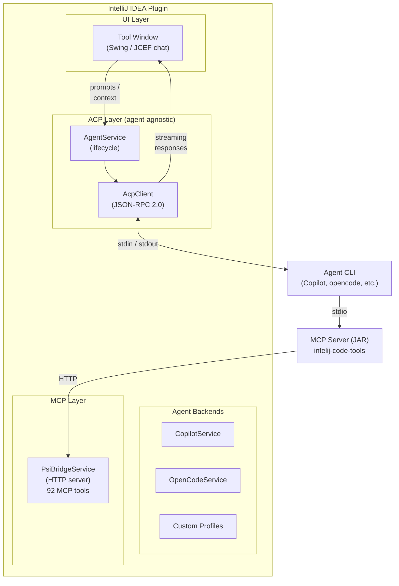

# AgentBridge

An ACP & MCP bridge connecting AI coding agents to your JetBrains IDE through **92 native MCP tools**.

Instead of operating through a terminal or generating diffs in isolation, agents work through
IntelliJ inspections, refactorings, the test runner, the build system, and Git — the same
tools you use.

## Status

**Working** — Plugin is functional with multi-agent support (GitHub Copilot, opencode, Claude Code, custom profiles).

### What Works

- Multi-turn conversation with any ACP-compatible agent
- 92 IntelliJ-native MCP tools (symbol search, file outline, references, test runner, code formatting, git,
  infrastructure, terminal, etc.)
- Agent profiles — switch between agents instantly, each with its own settings and permissions
- Built-in file operations redirected through IntelliJ Document API (undo support, no external file conflicts)
- Auto-format (optimize imports + reformat code) after every write
- Model selection with usage multiplier display
- Context management (attach files/selections to prompts)
- Real-time streaming responses

## Architecture

The plugin is organized into three distinct layers — **UI**, **ACP**, and **MCP** — designed so that
new agents can be added by implementing two small interfaces without touching the protocol or UI code.



### Three Layers

| Layer | Package | Purpose |
|-------|---------|---------|
| **UI** | `ui/` | Tool window, chat panel, model selector — agent-agnostic |
| **ACP** | `bridge/` | Generic Agent Client Protocol: `AcpClient` (JSON-RPC), `AgentService` (lifecycle), `AgentConfig` / `AgentSettings` (strategy interfaces) |
| **MCP** | `mcp-server/`, `psi/` | IDE tools exposed via Model Context Protocol over stdio + HTTP |

### Extending for New Agents

To add a new agent backend, implement two interfaces and extend one base class:

1. **`AgentConfig`** — Agent binary discovery, process building, initialize response parsing, auth
2. **`AgentSettings`** — Runtime settings: prompt timeout, max tool calls per turn, permission resolution
3. **`AgentService`** (extend) — Provides `createAgentConfig()` + `createAgentSettings()`, inherits full lifecycle (start/stop/restart/dispose)

The `AcpClient` and UI code require no changes — they program against the interfaces.

### Key Design: IntelliJ-Native File Operations

Built-in agent file edits are **denied** at the permission level. The agent automatically retries using
`intellij_write_file` MCP tool, which:

- Writes through IntelliJ's Document API (supports undo/redo)
- Auto-runs optimize imports + reformat code after every write
- Changes appear immediately in the editor (no "file changed externally" dialog)
- New files are created through VFS for proper project indexing

### Module Structure

```
intellij-copilot-plugin/
├── plugin-core/              # Main plugin (Java 21)
│   └── src/main/java/com/github/catatafishen/ideagentforcopilot/
│       ├── ui/               # UI layer — Tool Window (Swing/JCEF)
│       ├── services/         # AgentService (abstract), CopilotService, etc.
│       ├── bridge/           # ACP layer — AcpClient, AgentConfig,
│       │                     #   AgentSettings, Model, AuthMethod, etc.
│       └── psi/              # PsiBridgeService (92 MCP tools)
├── mcp-server/               # MCP stdio server (bundled JAR)
│   └── src/main/java/com/github/copilot/mcp/
│       └── McpServer.java
└── integration-tests/        # (placeholder)
```

## MCP Tools (92 tools)

| Category            | Tools                                                                                                                                                                                                                   |
|---------------------|-------------------------------------------------------------------------------------------------------------------------------------------------------------------------------------------------------------------------|
| **Code Navigation** | `search_symbols`, `get_file_outline`, `get_class_outline`, `find_references`, `list_project_files`, `search_text`, `go_to_declaration`, `get_type_hierarchy`, `find_implementations`, `get_call_hierarchy`, `get_documentation`, `download_sources` |
| **File I/O**        | `intellij_read_file`, `intellij_write_file`, `edit_text`, `create_file`, `delete_file`, `rename_file`, `move_file`, `undo`, `redo`, `reload_from_disk`, `open_in_editor`, `show_diff`                                   |
| **Code Quality**    | `get_problems`, `get_highlights`, `run_inspections`, `apply_quickfix`, `suppress_inspection`, `optimize_imports`, `format_code`, `add_to_dictionary`, `get_compilation_errors`, `run_qodana`, `run_sonarqube_analysis`*  |
| **Refactoring**     | `refactor`, `replace_symbol_body`, `insert_before_symbol`, `insert_after_symbol`                                                                                                                                        |
| **Testing**         | `list_tests`, `run_tests`, `get_coverage`                                                                                                                                                                               |
| **Project**         | `get_project_info`, `build_project`, `get_indexing_status`, `mark_directory`, `edit_project_structure`, `list_run_configurations`, `run_configuration`, `create_run_configuration`, `edit_run_configuration`, `delete_run_configuration` |
| **Git**             | `git_status`, `git_diff`, `git_log`, `git_blame`, `git_commit`, `git_stage`, `git_unstage`, `git_branch`, `git_stash`, `git_revert`, `git_show`, `git_push`, `git_remote`, `git_fetch`, `git_pull`, `git_merge`, `git_rebase`, `git_cherry_pick`, `git_tag`, `git_reset`, `get_file_history` |
| **Infrastructure**  | `http_request`, `run_command`, `read_ide_log`, `get_notifications`, `read_run_output`, `read_build_output`                                                                                                              |
| **Terminal**        | `run_in_terminal`, `write_terminal_input`, `read_terminal_output`, `list_terminals`                                                                                                                                     |
| **Editor**          | `open_in_editor`, `show_diff`, `create_scratch_file`, `list_scratch_files`, `run_scratch_file`, `get_active_file`, `get_open_editors`, `search_conversation_history`, `get_chat_html`, `list_themes`, `set_theme`        |

*\* `run_sonarqube_analysis` only available when SonarLint plugin is installed.*

## Requirements

- **JDK 21** (for plugin development)
- **IntelliJ IDEA 2025.3+** (any JetBrains IDE)
- **An ACP-compatible agent CLI** (e.g., GitHub Copilot CLI, opencode, Claude Code via [claude-code-acp](https://www.npmjs.com/package/@zed-industries/claude-code-acp))

## Quick Start

### Building

```bash
./gradlew :plugin-core:clean :plugin-core:buildPlugin
```

### Installing

Install via **Settings → Plugins → ⚙ → Install Plugin from Disk**, selecting the built ZIP.

**Or manually:**

**Linux:**

```bash
PLUGIN_DIR=~/.local/share/JetBrains/IntelliJIdea2025.3
rm -rf "$PLUGIN_DIR/plugin-core"
unzip -q plugin-core/build/distributions/plugin-core-*.zip -d "$PLUGIN_DIR"
```

**Windows (PowerShell):**

```powershell
# Close IntelliJ first, then:
Remove-Item "$env:APPDATA\JetBrains\IntelliJIdea2025.3\plugins\plugin-core" -Recurse -Force
Expand-Archive "plugin-core\build\distributions\plugin-core-*.zip" `
    "$env:APPDATA\JetBrains\IntelliJIdea2025.3\plugins" -Force
```

### Running Tests

```bash
./gradlew test    # All tests (unit + MCP)
```

## Technology Stack

- **Plugin**: Java 21, IntelliJ Platform SDK 2025.x, Swing
- **Protocol**: ACP (Agent Client Protocol) over JSON-RPC 2.0 / stdin+stdout
- **MCP Tools**: Model Context Protocol over stdio
- **Build**: Gradle 8.x with Kotlin DSL
- **Testing**: JUnit 5

## Known Copilot Platform Issues

Tracked issues on the Copilot CLI side that affect this plugin. When an issue is resolved upstream, the workaround can
be removed and the entry marked as ✅.

| # | Issue                                                                                         | Status  | Impact                                                                                                                                                                                                                                                         | Workaround                                                                                                                                                                                                                        |
|---|-----------------------------------------------------------------------------------------------|---------|----------------------------------------------------------------------------------------------------------------------------------------------------------------------------------------------------------------------------------------------------------------|-----------------------------------------------------------------------------------------------------------------------------------------------------------------------------------------------------------------------------------|
| 1 | [#1486](https://github.com/github/copilot-cli/issues/1486) — MCP `instructions` field ignored | 🔴 Open | Copilot ignores the `instructions` field from the MCP `initialize` response, so the agent never sees our tool-usage guidance.                                                                                                                                  | Plugin prepends instructions to `copilot-instructions.md` on project open ([PsiBridgeStartup.kt](plugin-core/src/main/java/com/github/catatafishen/ideagentforcopilot/psi/PsiBridgeStartup.kt)).                                  |
| 2 | [#556](https://github.com/github/copilot-cli/issues/556) — Tool filtering not respected       | 🔴 Open | `--available-tools` / `--excluded-tools` CLI flags and `tools/remove` MCP capability are all ignored in ACP mode. Re-validated on CLI v1.0.3 GA (Mar 2026): all four mechanisms still broken. Built-in tools (`view`, `edit`, `bash`, etc.) cannot be removed.  | Permission denial via ACP + sub-agent write blocking. See [CLI-BUG-556-WORKAROUND.md](docs/CLI-BUG-556-WORKAROUND.md).                                                                                                           |
| 3 | Sub-agents ignore custom instructions and agent definitions                                   | 🔴 Open | Sub-agents (explore, task, general-purpose) spawned via the `task` tool don't receive `.github/copilot-instructions.md` or `session/message` guidance. Read-only built-in tools (`view`, `grep`, `glob`) auto-execute without permission and can't be blocked. | Plugin bundles a custom [ide-explore agent](plugin-core/src/main/resources/agents/ide-explore.md) with instruction-based guidance to prefer IntelliJ MCP tools. Write tools (`edit`, `create`, `bash`) are blocked via permission denial. |

## Documentation

- [Development Guide](DEVELOPMENT.md) — Build, deploy, architecture details
- [Quick Start](QUICK-START.md) — Fast setup instructions
- [Features](FEATURES.md) — Complete tool documentation
- [Standalone MCP Server](docs/STANDALONE-MCP.md) — Use IDE tools with any MCP client
- [Testing](TESTING.md) — Test running and coverage
- [Roadmap](ROADMAP.md) — Project phases and future work
- [Release Notes](RELEASE_NOTES.md) — Current release details

## Contributing

Contributions are welcome! Please see [CONTRIBUTING.md](CONTRIBUTING.md) for guidelines.

## Security

To report security vulnerabilities, please see [SECURITY.md](SECURITY.md).

## License

Copyright 2026 Henrik Westergård

Licensed under the Apache License, Version 2.0 (the "License");
you may not use this file except in compliance with the License.
You may obtain a copy of the License at

    http://www.apache.org/licenses/LICENSE-2.0

Unless required by applicable law or agreed to in writing, software
distributed under the License is distributed on an "AS IS" BASIS,
WITHOUT WARRANTIES OR CONDITIONS OF ANY KIND, either express or implied.
See the License for the specific language governing permissions and
limitations under the License.

See [LICENSE](LICENSE) for the full text.
