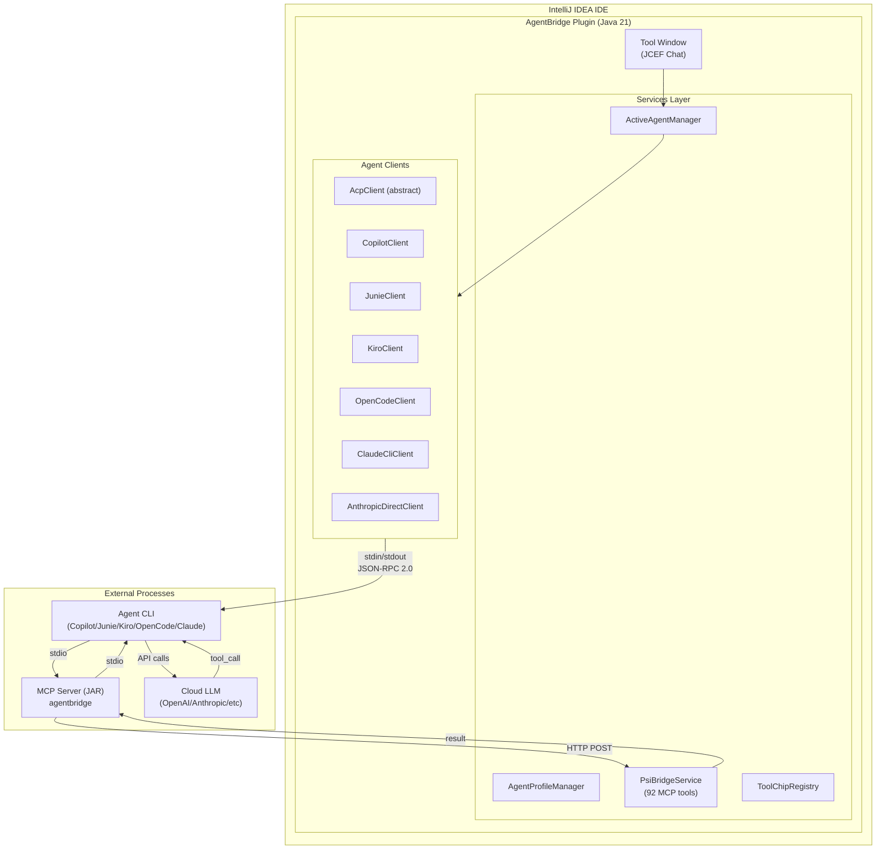
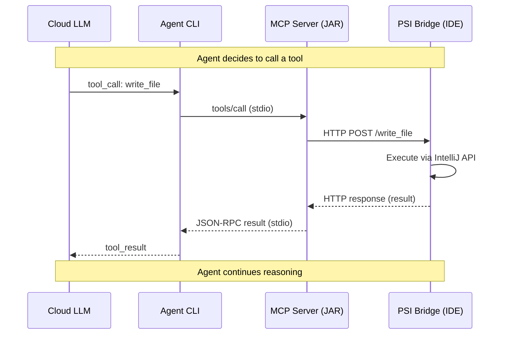
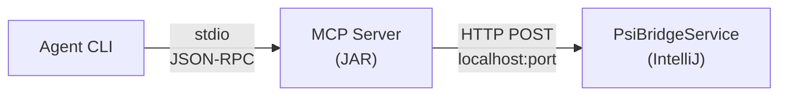
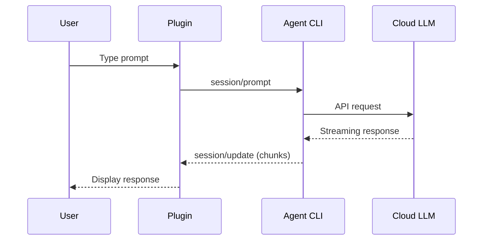
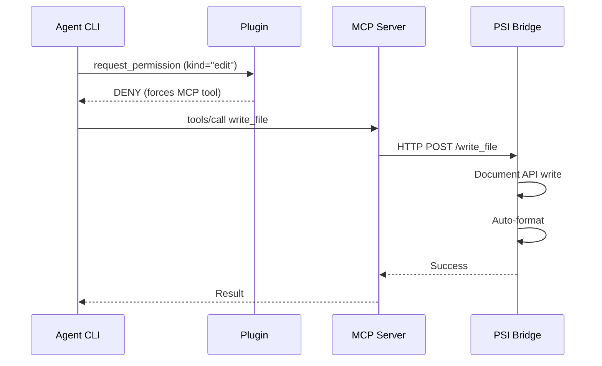

# Architecture Overview

## System Architecture



## Tool Call Round-Trip



---

## Component Details

### 1. Services Layer

#### ActiveAgentManager (Project-level)

Central service that manages the active agent profile and client lifecycle:

- Stores which `AgentProfile` is currently active
- Creates and owns the `AbstractAgentClient` for the active profile
- Handles client start/stop/restart/dispose
- Provides shared UI preferences (attach trigger, follow-agent-files)

```java
@Service(Service.Level.PROJECT)
public final class ActiveAgentManager implements Disposable {
    private AbstractAgentClient acpClient;
    private AgentConfig cachedConfig;
    
    public void setActiveProfile(AgentProfile profile);
    public AbstractAgentClient getClient();
    public void startAgent();
    public void stopAgent();
}
```

#### AgentProfileManager (Application-level)

Manages the collection of available agent profiles:

- Built-in profiles: GitHub Copilot, OpenCode, Junie, Kiro, Claude Code, Hermes Agent
- Custom user-defined profiles
- Profile persistence and serialization

#### PsiBridgeService (Project-level)

HTTP server exposing 92 IntelliJ-native MCP tools:

- Starts on dynamic localhost port
- Handles tool invocations from MCP server
- Accesses PSI, VFS, Document API, Git4Idea, etc.

### 2. Agent Clients

All agent clients extend `AbstractAgentClient`, which provides common functionality:

- Session management (create, prompt, cancel)
- Model selection
- Event streaming and listeners
- Connection lifecycle

#### ACP-Based Clients

For agents that use the Agent Client Protocol (JSON-RPC 2.0 over stdio):

| Client | Agent | Notes |
|--------|-------|-------|
| `CopilotClient` | GitHub Copilot CLI | Full ACP, permission requests |
| `JunieClient` | JetBrains Junie | ACP without permissions |
| `KiroClient` | Amazon Kiro | ACP with tool filtering |
| `OpenCodeClient` | OpenCode | ACP with config-based permissions |

#### Claude-Based Clients

For Anthropic Claude agents (different protocol):

| Client | Agent | Notes |
|--------|-------|-------|
| `ClaudeCliClient` | Claude Code CLI | Uses claude-code-acp wrapper |
| `AnthropicDirectClient` | Anthropic API | Direct API calls, no CLI |

### 3. Profile-Based Configuration

`ProfileBasedAgentConfig` creates agent configuration from an `AgentProfile`:

- CLI command and arguments
- Environment variables (MCP server config, API keys)
- Tool filtering (excludedTools parameter)
- Permission injection method (CLI flags, JSON config, or none)
- Session instructions

### 4. MCP Tool Bridge

The MCP Server is a **pass-through** that routes tool calls from the Agent CLI to the PSI Bridge:



- **MCP Server** (`mcp-server/`): Standalone JAR spawned by Agent CLI, receives tool calls via stdio, forwards to PSI Bridge via HTTP
- **PSI Bridge** (`PsiBridgeService`): HTTP server inside IntelliJ process, executes tools using IntelliJ APIs
- **Bridge file**: `~/.copilot/psi-bridge.json` contains the dynamic port

---

## Data Flow

### Prompt Flow



### Permission Flow (ACP agents with permissions)



---

## Key Files

| File | Purpose |
|------|---------|
| `services/ActiveAgentManager.java` | Active profile and client lifecycle |
| `services/AgentProfileManager.java` | Profile collection management |
| `acp/client/AcpClient.java` | Base ACP client (JSON-RPC 2.0) |
| `acp/client/CopilotClient.java` | GitHub Copilot implementation |
| `acp/client/JunieClient.java` | JetBrains Junie implementation |
| `agent/claude/ClaudeCliClient.java` | Claude Code CLI implementation |
| `bridge/ProfileBasedAgentConfig.java` | Profile → AgentConfig conversion |
| `psi/PsiBridgeService.java` | 92 MCP tools via IntelliJ APIs |

---

## Security Considerations

### Tool Permissions

- **deny**: Never execute (fail immediately)
- **ask**: Prompt user for approval
- **allow**: Execute without prompt

### Sensitive Operations

Always require approval:
- `git_push --force`
- `run_command` (shell commands)
- File deletions
- Operations outside project root

---

*Last Updated: 2026-03-22*
