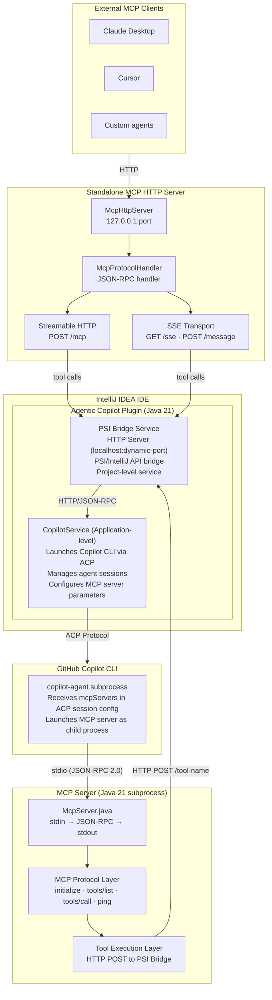
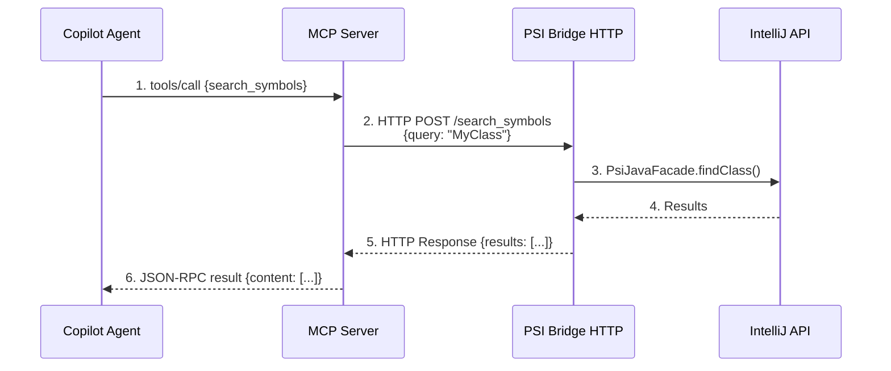
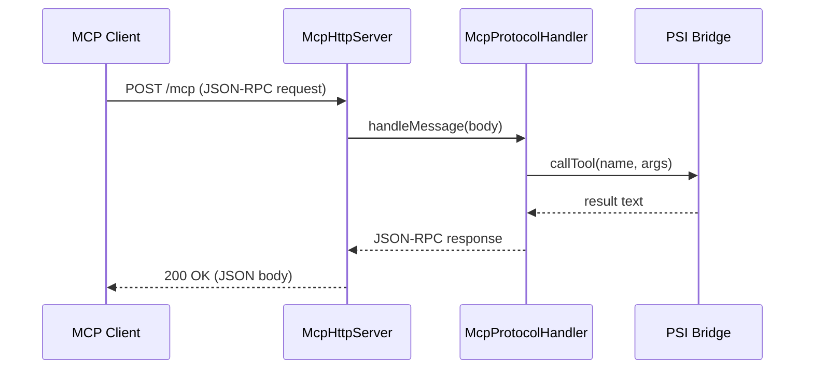
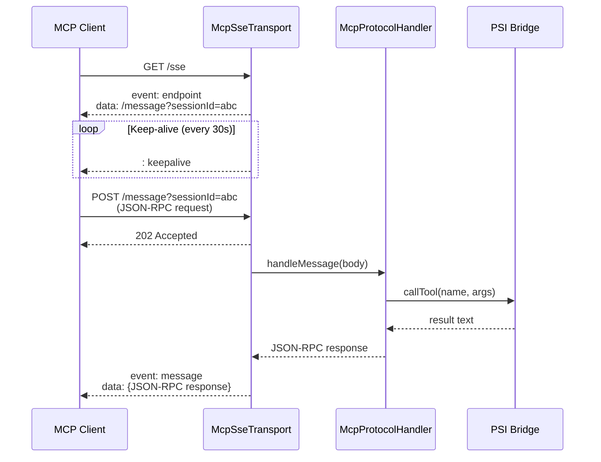

# MCP Architecture Documentation

## Overview

The **Model Context Protocol (MCP)** integration in this IntelliJ plugin provides a standardized way for AI agents (via
GitHub Copilot) to interact with IntelliJ IDEA's code intelligence, project structure, and development tools.

The MCP server acts as a bridge between the Copilot agent and IntelliJ's internal APIs, exposing 60 tools through a
JSON-RPC stdio interface.

---

## Architecture Diagram



---

## Component Details

### 1. PSI Bridge Service (Plugin-side)

**Location:** `plugin-core/src/main/java/com/github/copilot/intellij/psi/`

**Purpose:** Exposes IntelliJ's internal APIs via HTTP for consumption by the MCP server.

**Key Files:**

- `PsiBridgeService.java` - HTTP server that handles tool invocations
- `PsiBridgeStartup.java` - Starts the bridge when project opens

**Responsibilities:**

- Starts HTTP server on dynamic port (localhost only)
- Exposes 60 tools as HTTP endpoints
- Translates HTTP requests into IntelliJ API calls
- Returns results as JSON responses
- Manages per-project instance lifecycle

**Port Discovery:** The MCP server discovers the PSI Bridge port via an environment variable or config file set by the
plugin when launching the Copilot CLI.

---

### 2. Copilot Service (Plugin-side)

**Location:** `plugin-core/src/main/java/com/github/copilot/intellij/services/CopilotService.java`

**Purpose:** Manages GitHub Copilot CLI lifecycle and ACP communication.

**Responsibilities:**

- Launches `copilot-agent` CLI with MCP configuration
- Passes `mcpServers` parameter in ACP session creation
- Configures MCP server JAR path, working directory, and transport
- Manages agent sessions and streaming responses
- Handles Copilot authentication flow

**MCP Configuration Example:**

```json
{
  "mcpServers": {
    "intellij-code-tools": {
      "command": "java",
      "args": [
        "-cp",
        "/path/to/mcp-server.jar",
        "com.github.copilot.mcp.McpServer",
        "/path/to/project/root"
      ],
      "transport": "stdio",
      "env": {
        "PSI_BRIDGE_PORT": "12345"
      }
    }
  }
}
```

---

### 3. MCP Server (Subprocess)

**Location:** `mcp-server/src/main/java/com/github/copilot/mcp/McpServer.java`

**Purpose:** Lightweight JSON-RPC server exposing IntelliJ capabilities to AI agents.

**Transport:** stdio (JSON-RPC 2.0)

**Protocol Version:** 2025-03-26 (MCP specification)

#### Startup Flow

1. Plugin starts PSI Bridge HTTP server (e.g., port 12345)
2. Copilot CLI is launched with MCP server configuration
3. Copilot agent spawns MCP server as child process:
   ```bash
   java -cp mcp-server.jar com.github.copilot.mcp.McpServer /project/root
   ```
4. MCP server reads from stdin, writes to stdout
5. Agent sends `initialize` request, server responds with capabilities
6. Agent sends `tools/list` request to discover available tools
7. Agent can now invoke tools via `tools/call` requests

#### JSON-RPC Message Format

**Request:**

```json
{
  "jsonrpc": "2.0",
  "id": 1,
  "method": "tools/call",
  "params": {
    "name": "search_symbols",
    "arguments": {
      "query": "MyClass",
      "type": "class"
    }
  }
}
```

**Response:**

```json
{
  "jsonrpc": "2.0",
  "id": 1,
  "result": {
    "content": [
      {
        "type": "text",
        "text": "Found 3 classes:\n1. MyClass at src/MyClass.java:10\n..."
      }
    ]
  }
}
```

### 4. Standalone MCP HTTP Server

**Location:** `standalone-mcp/src/main/java/com/github/catatafishen/idemcpserver/`

**Purpose:** Exposes the same MCP tools over HTTP for external AI agents (Claude Desktop, Cursor,
custom MCP clients) that cannot use the stdio-based subprocess model.

**Key classes:**

| Class                          | Role                                                             |
|--------------------------------|------------------------------------------------------------------|
| `McpHttpServer`                | Starts `com.sun.net.httpserver.HttpServer`, registers endpoints  |
| `McpProtocolHandler`           | Stateless JSON-RPC handler (shared by all transports)            |
| `McpSseTransport`              | SSE session management, `/sse` and `/message` endpoints          |
| `SseSession`                   | Single SSE client connection (event stream, keep-alive)          |
| `McpServerSettings`            | Persistent settings: port, auto-start, transport mode            |
| `McpServerGeneralConfigurable` | Settings UI (port, transport mode, auto-start, follow agent)     |
| `McpServerToggleAction`        | Toolbar toggle to start/stop the server                          |

#### Transport Modes

Configured in **Settings → Tools → IDE Agent for Copilot → MCP Server → General**.

##### Streamable HTTP (default)

Single request/response model — the simplest transport for MCP.

| Endpoint      | Method  | Description                            |
|---------------|---------|----------------------------------------|
| `/mcp`        | POST    | JSON-RPC request → JSON-RPC response   |
| `/health`     | GET     | Server status check                    |

Client config:
```json
{
  "mcpServers": {
    "ide-mcp-server": {
      "url": "http://127.0.0.1:8642/mcp"
    }
  }
}
```

##### SSE (Server-Sent Events)

Long-lived event stream — required by some MCP clients (e.g., older Claude Desktop versions).

| Endpoint              | Method | Description                                    |
|-----------------------|--------|------------------------------------------------|
| `/sse`                | GET    | Opens SSE stream; sends `endpoint` event       |
| `/message?sessionId=` | POST   | Receives JSON-RPC; response via SSE stream     |
| `/health`             | GET    | Server status check                            |

**SSE protocol flow:**

1. Client opens `GET /sse` → server sends `event: endpoint\ndata: /message?sessionId=xxx\n\n`
2. Client sends JSON-RPC to `POST /message?sessionId=xxx`
3. Server responds with HTTP 202 (accepted) and pushes the JSON-RPC response through
   the SSE stream as `event: message\ndata: {...}\n\n`
4. A keep-alive comment (`: keepalive`) is sent every 30 seconds to prevent timeouts

Client config:
```json
{
  "mcpServers": {
    "ide-mcp-server": {
      "url": "http://127.0.0.1:8642/sse"
    }
  }
}
```

#### Startup Flow (Standalone)

1. `McpServerStartup` runs on project open
2. `PsiBridgeService` is started (tool handlers)
3. If auto-start is enabled, `McpHttpServer.start()` is called
4. Based on `TransportMode` setting, registers either `/mcp` or `/sse` + `/message` endpoints
5. Server listens on `127.0.0.1:<port>` (localhost only)

---

## Tool Categories

The MCP server exposes **60 tools** organized into 11 categories:

### 1. Code Navigation (5 tools)

- `search_symbols` - Find class/method/interface definitions via AST
- `get_file_outline` - Get file structure with line numbers
- `find_references` - Find all usages of a symbol
- `list_project_files` - List source files in project
- `list_tests` - Discover test classes and methods

### 2. Testing & Quality (2 tools)

- `run_tests` - Execute tests via IntelliJ test runner
- `get_coverage` - Read JaCoCo/IntelliJ coverage data

### 3. Project Environment (3 tools)

- `get_project_info` - Get JDK, modules, build system info
- `list_run_configurations` - List IntelliJ run configs
- `get_problems` - Get warnings/errors from IntelliJ inspections

### 4. Run Configurations (3 tools)

- `run_configuration` - Execute existing run config
- `create_run_configuration` - Create new run config
- `edit_run_configuration` - Modify existing run config

### 5. Code Editing (4 tools)

- `intellij_read_file` - Read file via IntelliJ buffer (supports unsaved changes)
- `intellij_write_file` - Write file via Document API (undo support, VCS tracking)
- `optimize_imports` - Organize imports per code style
- `format_code` - Format code per code style

### 6. Git Operations (11 tools)

- `git_status`, `git_diff`, `git_log`, `git_show` - Repository inspection
- `git_commit`, `git_stage`, `git_unstage` - Staging and commits
- `git_branch` - Branch management (list/create/switch/delete)
- `git_stash` - Stash operations (push/pop/list/apply/drop)
- `git_blame` - Line-by-line authorship

### 7. Infrastructure (2 tools)

- `http_request` - Make HTTP calls (for API testing)
- `run_command` - Execute shell commands in project directory

### 8. Terminal & Logs (6 tools)

- `run_in_terminal` - Execute commands in IntelliJ terminal tabs
- `list_terminals` - List available shells and terminal tabs
- `read_terminal_output` - Read terminal content
- `read_run_output` - Read Run panel output
- `read_ide_log` - Read IntelliJ's idea.log
- `get_notifications` - Get IDE notifications

### 9. Documentation (3 tools)

- `get_documentation` - Get Javadoc for JDK/library symbols
- `download_sources` - Check/download source JARs for dependencies
- `create_scratch_file` - Create scratch files with syntax highlighting

---

## Data Flow: Tool Invocation

### Stdio Transport (Copilot CLI)



### Streamable HTTP Transport



### SSE Transport



### Execution Steps

**Stdio path** (Copilot CLI → MCP subprocess):

1. Copilot agent sends `tools/call` via stdio
2. McpServer parses JSON-RPC, extracts tool name and arguments
3. MCP server makes HTTP POST to PSI Bridge
4. PSI Bridge invokes IntelliJ API (PSI, VFS, Git4Idea, etc.)
5. Result serialized to JSON, returned via HTTP → JSON-RPC → stdout

**HTTP path** (external clients → standalone server):

1. Client sends JSON-RPC to `/mcp` (Streamable HTTP) or `/message` (SSE)
2. McpProtocolHandler parses request, delegates to PsiBridgeService
3. PsiBridgeService invokes IntelliJ API directly (in-process, no HTTP hop)
4. Response returned as HTTP body (Streamable) or SSE event (SSE)

---

## Configuration & Environment

### Project Root Discovery

The MCP server receives the project root as the first CLI argument:

```bash
java -cp mcp-server.jar com.github.copilot.mcp.McpServer /path/to/project
```

All relative paths in tool calls are resolved against this root.

### PSI Bridge Port Discovery

The MCP server needs to know which port the PSI Bridge is listening on. Options:

1. **Environment Variable** (recommended):
   ```bash
   export PSI_BRIDGE_PORT=12345
   java -cp mcp-server.jar com.github.copilot.mcp.McpServer /project
   ```

2. **Config File** (alternative):
   The MCP server reads `.psi-bridge-port` in the project root

3. **Fixed Port** (development only):
   Hard-coded default port (e.g., 12300)

---

## Error Handling

### MCP Server Errors

**JSON-RPC Error Response:**

```json
{
  "jsonrpc": "2.0",
  "id": 1,
  "error": {
    "code": -32601,
    "message": "Method not found: invalid_method"
  }
}
```

**Error Codes:**

- `-32600` - Invalid Request
- `-32601` - Method Not Found
- `-32602` - Invalid Params
- `-32603` - Internal Error

### PSI Bridge Errors

**HTTP Error Responses:**

- `400 Bad Request` - Invalid tool arguments
- `404 Not Found` - Unknown tool name
- `500 Internal Server Error` - IntelliJ API failure

**Example:**

```json
{
  "error": "Tool not found: invalid_tool_name",
  "details": "Available tools: search_symbols, get_file_outline, ..."
}
```

### Agent Handling

When a tool call fails:

1. Agent receives error in JSON-RPC response
2. Agent may retry with corrected parameters
3. Agent may ask user for clarification
4. Agent may switch to alternative tool or approach

---

## Tool Usage Guidelines

The MCP server includes usage instructions in the `initialize` response:

```
IMPORTANT TOOL USAGE RULES:
1. ALWAYS use 'intellij_write_file' for ALL file writes and edits.
   This writes through IntelliJ's Document API, supporting undo (Ctrl+Z),
   VCS tracking, and editor sync.

2. ALWAYS use 'intellij_read_file' for ALL file reads.
   This reads IntelliJ's live editor buffer, which may have unsaved changes.

3. After making ANY code changes, ALWAYS run 'optimize_imports' and
   'format_code' on each changed file.

4. Use 'get_problems' to check for warnings and errors after changes.

5. PREFER IntelliJ tools (search_symbols, find_references, get_file_outline,
   list_project_files) over grep/glob for code navigation.
```

These guidelines help the AI agent use IntelliJ's native capabilities effectively.

---

## Security Considerations

### Localhost-Only Communication

- PSI Bridge only binds to `127.0.0.1` (localhost)
- No external network access
- MCP server only accepts stdio input from parent process

### Process Isolation

- MCP server runs as subprocess with limited privileges
- Cannot access files outside project root (enforced by PSI Bridge)
- No shell command execution without explicit `run_command` tool

### Input Validation

- All tool arguments validated before execution
- Path traversal attempts (e.g., `../../etc/passwd`) rejected
- Dangerous operations (force push, file deletion) require confirmation

---

## Performance Optimization

### Caching Strategies

**PSI Bridge:**

- Cache PSI parse trees (managed by IntelliJ)
- Cache project file index queries (5-minute TTL)
- Reuse HTTP connections (keep-alive)

**MCP Server:**

- Stateless design (no caching needed)
- Fast JSON parsing with Gson
- Minimal memory footprint (~50 MB)

### Concurrency

**PSI Bridge:**

- Handles multiple simultaneous tool calls
- Uses IntelliJ's read/write locks for PSI access
- Background threads for long-running operations

**MCP Server:**

- Single-threaded (one request at a time)
- Agent manages concurrency at higher level
- Fast response times (<100ms for most tools)

---

## Testing Strategy

### MCP Server Tests

**Location:** `mcp-server/src/test/java/com/github/copilot/mcp/McpServerTest.java`

**Coverage:**

- Protocol conformance (initialize, tools/list, tools/call)
- Error handling (invalid JSON, unknown methods)
- Tool argument validation
- Mock PSI Bridge responses

**Example:**

```java

@Test
void testToolsListReturnsAllTools() {
    JsonObject request = new JsonObject();
    request.addProperty("jsonrpc", "2.0");
    request.addProperty("id", 1);
    request.addProperty("method", "tools/list");

    JsonObject response = McpServer.handleMessage(request);

    assertEquals("2.0", response.get("jsonrpc").getAsString());
    JsonArray tools = response.getAsJsonObject("result")
            .getAsJsonArray("tools");
    assertTrue(tools.size() >= 36);
}
```

### Integration Tests

**Location:** `integration-tests/`

**Scenarios:**

- Full plugin startup with MCP server launch
- End-to-end tool invocations
- Error recovery (MCP server crash, network timeout)
- Multi-project scenarios

---

## Troubleshooting

### MCP Server Not Starting

**Symptoms:** Agent fails to connect, no tools available

**Diagnosis:**

1. Check Copilot CLI logs: `copilot-agent --debug`
2. Verify JAR path in MCP configuration
3. Check Java version (requires Java 21+)

**Solutions:**

- Rebuild MCP server: `./gradlew :mcp-server:jar`
- Verify `JAVA_HOME` points to Java 21+
- Check project root path is correct

### PSI Bridge Connection Failed

**Symptoms:** MCP tools return 500 errors

**Diagnosis:**

1. Check PSI Bridge port: `cat .psi-bridge-port`
2. Verify HTTP server is running: `curl http://localhost:12345/health`
3. Check IntelliJ logs: Help → Show Log in Files

**Solutions:**

- Restart plugin: Disable/Enable in Settings → Plugins
- Check firewall (should allow localhost connections)
- Verify no port conflicts (PSI Bridge uses dynamic port)

### Tool Calls Timeout

**Symptoms:** Agent waits indefinitely, no response

**Diagnosis:**

1. Check IntelliJ UI is not frozen (modal dialogs, indexing)
2. Verify read actions are not blocked (PSI lock contention)
3. Check MCP server logs: `stderr` from subprocess

**Solutions:**

- Wait for indexing to complete
- Close modal dialogs in IntelliJ
- Reduce concurrency (fewer simultaneous tool calls)

---

## Future Enhancements

### Protocol Improvements

- **SSE Transport:** ✅ Implemented — configurable in MCP Server settings
- **WebSocket Transport:** Replace stdio with WebSocket for bidirectional streaming
- **Batch Tool Calls:** Execute multiple tools in single request
- **Streaming Results:** Return large results incrementally

### Tool Additions

- **Refactoring Tools:** Rename, extract method, inline variable
- **Debugging Tools:** Set breakpoints, evaluate expressions
- **Database Tools:** Query databases, inspect schemas

### Performance

- **Persistent MCP Server:** Keep server running across sessions
- **Connection Pooling:** Reuse HTTP connections to PSI Bridge
- **Result Compression:** Gzip large JSON responses

---

## References

- [Model Context Protocol Specification](https://spec.modelcontextprotocol.io/)
- [GitHub Copilot CLI Documentation](https://docs.github.com/en/copilot/using-github-copilot/using-github-copilot-in-the-command-line)
- [IntelliJ Platform SDK](https://plugins.jetbrains.org/docs/intellij/welcome.html)
- [JSON-RPC 2.0 Specification](https://www.jsonrpc.org/specification)
